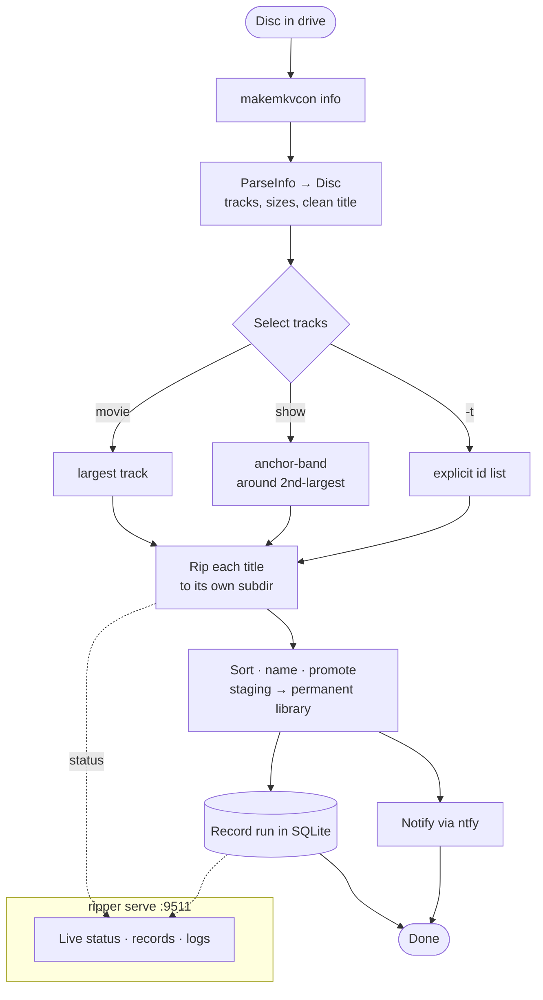

<p align="center">
  
</p>

<h1 align="center">Ripper</h1>

<p align="center">
  Pull titles off optical discs, sort them into a tidy library, watch it happen from a browser.
</p>

A home media ripping tool. It drives MakeMKV to pull titles off optical discs
(Blu-ray / DVD), organizes them into a Jellyfin-friendly library layout, records
each run in a small SQLite database, and serves a status page so you can watch
rips in progress from a browser.

It's a personal project for my own media server — no packaging, no config
defaults meant for anyone else's machine. Notes to self, mostly.

## What it does



A rip roughly goes:

1. `makemkvcon info` reads the disc and `ParseInfo` turns it into a `Disc`
   (tracks with sizes, durations, source order, plus a cleaned-up title with the
   `SEASON`/`DISC` cruft stripped off).
2. Track selection picks what's worth keeping — largest track for a movie, an
   anchor-band around the second-largest for a show (skips the "play all"
   title), or an explicit list with `-t`.
3. Each selected title rips to its own subdir so the id→file mapping is exact,
   then gets sorted, named, and promoted from staging into the permanent library.
4. The run is recorded in the DB and a notification fires via [ntfy](https://ntfy.sh/).

There's also a **librarian** side (`ripper lib`) that pulls the full catalog from
Jellyfin and dumps it into a Bookstack page — a plain-text inventory of what's on
the shelf.

## Status

Mid-migration. The original pipeline lives in `scripts/media-ripper.sh`; the work
in progress is porting its logic into Go (`internal/makemkv`), leaving bash to
orchestrate only the streaming hardware commands (`makemkvcon`, `rsync`). The
end goal is a long-lived daemon that owns rip state and pushes updates to the web
UI over SSE. See [ROADMAP.md](ROADMAP.md) for the full plan and the decisions
behind it.

## Commands

The binary is a [Cobra](https://github.com/spf13/cobra) CLI:

| Command | What it does |
|---|---|
| `ripper rip <drv> <movie\|show> [season]` | Start a rip on drive `<drv>`. `-e` ejects when done, `-t` enables manual track selection. |
| `ripper lib` | Pull the Jellyfin catalog and push it to Bookstack. |
| `ripper unlock <drv>` | Remove a stale drive lock file. |
| `ripper record <drive tag>` | Record the current run's stats into the DB (called by the rip script on exit). |
| `ripper records` | List all rip records from the DB. |
| `ripper serve` | Start the status web server (port `9511`). |

## Configuration

Config comes from env files in `/etc/ripper/` (loaded at startup by
`internal/prflt`):

- **`rip.env`** — `PERMANENT`, `STAGING`, `STATUS_TMP`, `LOG_TMP`, `NTFY_URL`,
  `RIP_DB_PATH`.
- **`libr.env`** — `JELLYFIN_URL`, `JELLYFIN_API_KEY`, `BOOKSTACK_URL`,
  `BOOKSTACK_PAGE_ID`, `BOOKSTACK_TOKEN_ID`, `BOOKSTACK_API_KEY`.

Missing rip config gates the rip commands; missing librarian config gates `lib`.
One side being misconfigured doesn't block the other. The bash scripts are
expected at `/usr/local/libexec/`.

## Web UI

`ripper serve` starts an HTTP server on `:9511`:

- `/` — live status of all drives (currently a `<meta refresh>` full-page reload;
  SSE is on the roadmap).
- `/records` and `/records/{run_id}` — history and per-run detail (logs, sizes).
- `/json` — status as JSON.
- `/logs/current/{drv}` — current rip log for a drive.

Templates and static assets (htmx, logo) are embedded in the binary.

## Build & deploy

```sh
go build -o ripper .
```

Runs as a systemd service (`systemd/ripper.service`) — `ripper serve` under a
dedicated user, restarted on failure. Deployment is handled by the Gitea Actions
workflow in `.gitea/workflows/` on push to `main`.

Requires `makemkvcon`, `rsync`, and the disc/notification tooling the scripts
shell out to (`eject`, `clamdscan`, `curl`, etc.) on the host.
